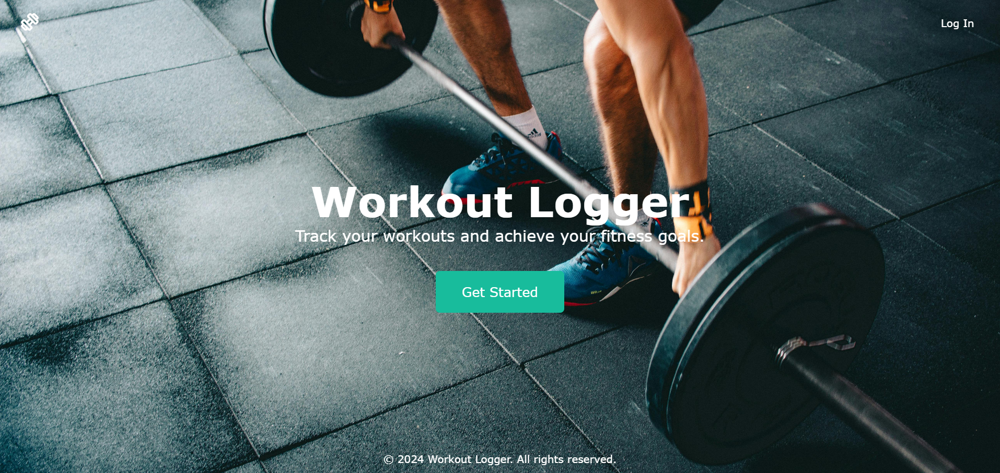
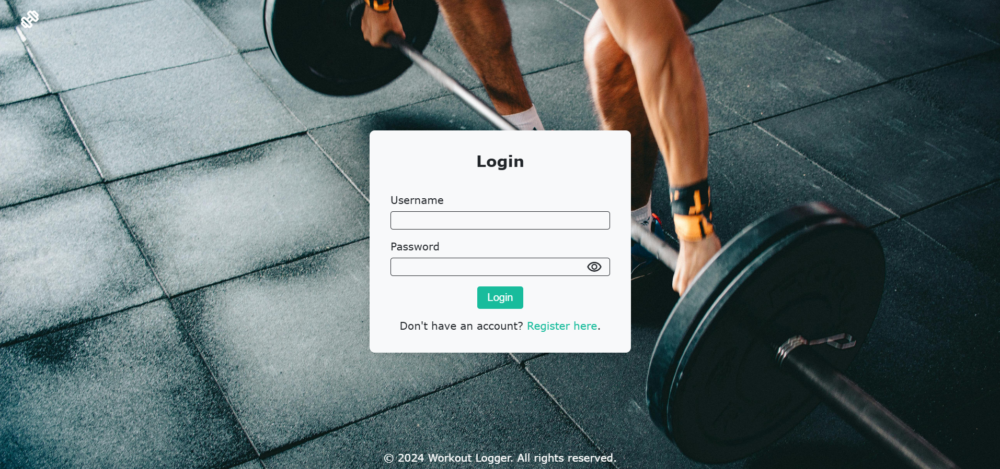
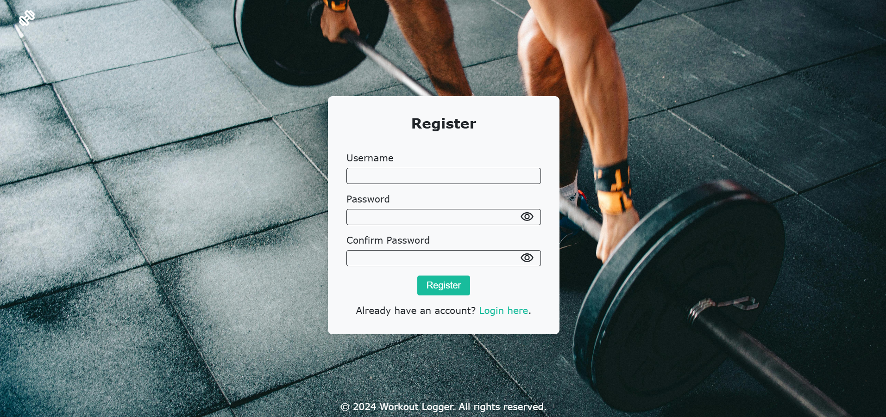
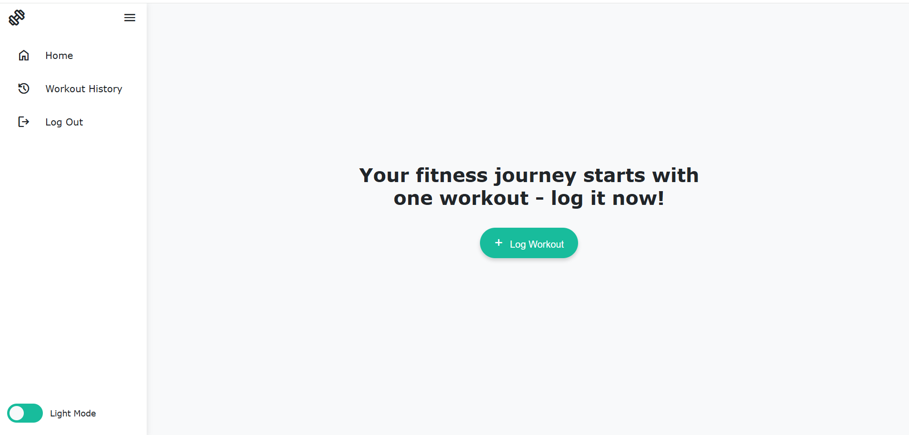
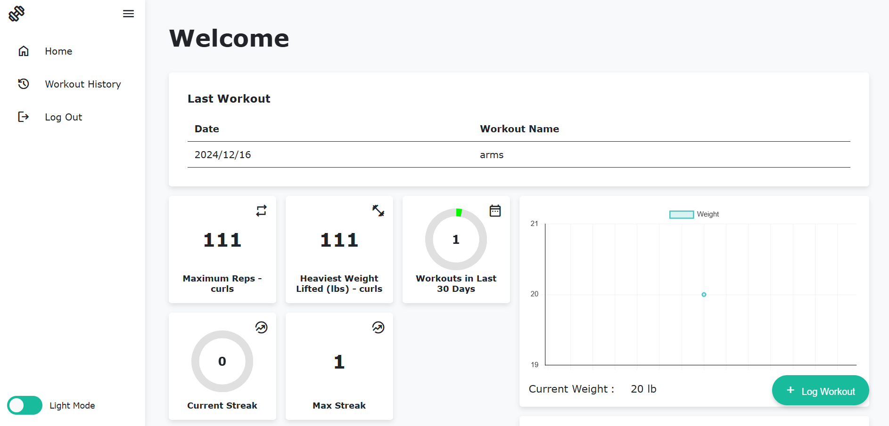
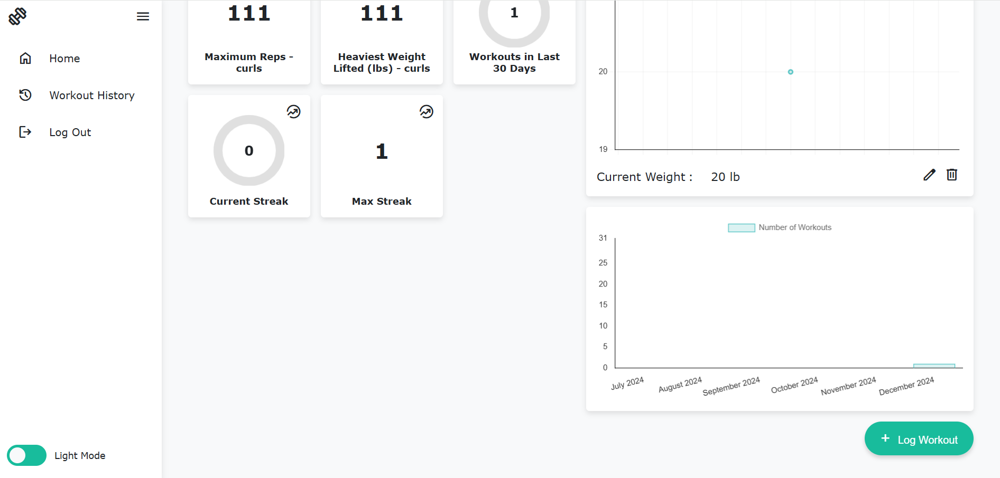
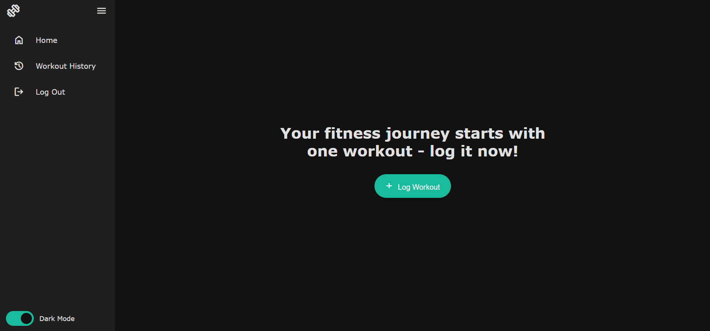
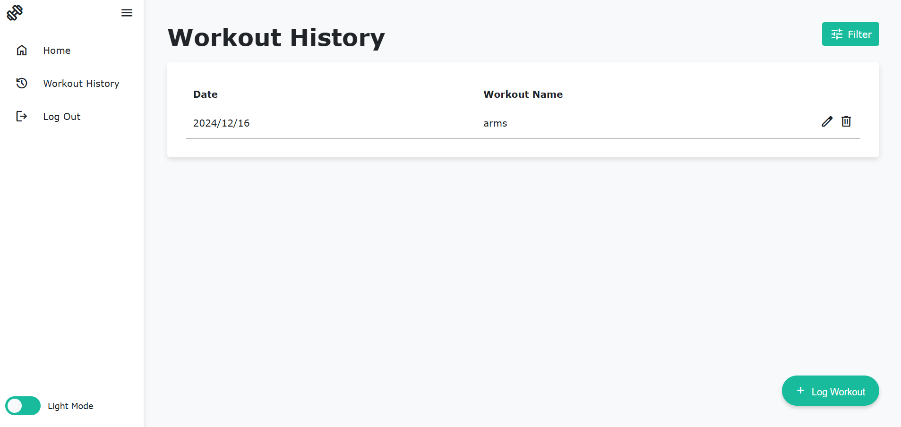

# Workout Logger

A web application to log and track your workouts. The Workout Logger allows users to register, log in, and record their exercises, sets, and reps. It supports different types of exercises such as bodyweight, resistance band, and weighted exercises.

# Mentorship Acknowledgment

This project was developed under the mentorship of **[Evan Watton](https://github.com/evnwttn)** as part of the **[GetBuilding](https://github.com/getcoding-ca)** Mentorship Program. Their guidance was instrumental in shaping the project's features and design.

## Features

- **User Authentication**: Secure registration and login functionality.
- **Workout Logging**: Add workouts with multiple exercises and sets.
- **Exercise Types**: Support for bodyweight, resistance band, and weighted exercises.
- **Dynamic Forms**: Add or remove exercises and sets dynamically.
- **Responsive Design**: Mobile-friendly layout with a sidebar navigation.
- **Theme Toggle**: Switch between light and dark modes.

# Running the Project Locally

If you’d like to run the Workout Logger on your local machine, follow the steps below:

1. **Clone the Repository**

```
git clone https://github.com/kskaman/workout-logger.git
```

2. **Navigate to the Project Directory**

```
cd workout-logger
```

3. **Install Dependencies**

```
npm install
```

4. **Start a Local Development Server**

```
npm run dev
```

5. **View the Application**
   Open your browser and navigate to view and interact with the Workout Logger.

# Project Previews

Below are a few screenshots showcasing the interface and features of the Workout Logger:

**Landing Page** -


**Login Page** -


**Register Page** -


**Dashboard** -




**Dark Mode Toggle** -


**Workout History** =


(Ensure that you have placed the corresponding images in an images directory within the repository. Adjust the image paths in the markdown as needed.)

## Live Demo

You can view the completed project on GitHub Pages: [https://kskaman.github.io/workout-logger/](https://kskaman.github.io/workout-logger/)

**Contact**
For any questions or suggestions, please open an issue or contact the project maintainer.

`**Note**: This project is currently under development. Some features may not be fully implemented yet.`
